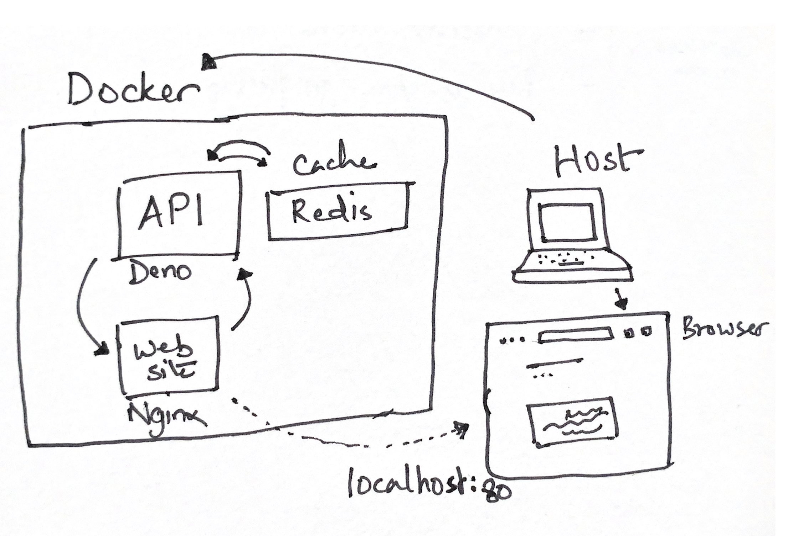

# Hooligan Watch

## Run locally

```shell
$ docker-compose up -d
```

- [Website](./website/Readme.md) at `localhost`
- [API](./api/Readme.md) server at `localhost:3000`

## Solution Architecture

### Local



### Cloud (not deployed)


## Deploy

Would have used Terraform to deploy. Easier to manage.

## Stream of consciousness

### Working through the problem

> Using the open APIs listed below, build a service which returns a list of
> **recorded crimes** for **League football stadiums** sorted by year & month. 
> The service should return **relevant information** which allows the service 
> consumer to **contextualise** the crime data (i.e information from the services
> which give more details about the team, area & crimes). The details of how 
> you organise and/or visualise the data & how users access the data is up to
> you, please consider the user or developer experience in your service design.

Lots of unknowns:
- recorded crimes
- league football stadiums
- what constitutes "relevant" information
- how to best "contextualise" crime data, suppose this will determine what's
  "relevant" too

Unknown data - crimes, stadium locations – is easy to solve for, fetch them from
suggested APIs.

Unknown design - relevancy, proper context - is harder. Visual presentation will 
dictate data design and API behaviour.

Right, let's pick the low hanging fruit first and then we'll scour the internet 
for some inspiration on how to visualise crime data.

Consult API documentation to understand:
  1. data design (lexicon, scope, domain-specific terminology etc.) and availability
  2. API design
  3. access patterns supported - request/response, streams, webhooks etc.
  4. pricing and usage restrictions

**Gosh stadium API no longer exists. Time for a rethink. Hmm... how about make a page
that shows crimes reported at Premier League stadiums in a given year. Do a stacked
area chart, to show distribution by club and on a monthly basis.** Time to meet old 
friend D3.js.

Premier League stadiums because there are only 20 and I can create a list of geo coordinates
by hand easily. 

The Police API is janky af, will 100% crash on me during demo, not much time for putting
in guardrails. Has usage restrictions too, plus historical crime numbers will not change
(however `outcomeStatus` of a crime may change in the future, but that's irrelvant for now).
so let's stick a cache in there to obviate the need for round trips on each render of
the chart.

Cool, solution architecture clearing up in the head.
- A frontend with a (or more, time permitting) chart depicting stadium-wise crime data by year
- A backend which supplies the data for a year for a given list of locations (stadiums)
- An in-memory cache (memcache or Redis) to cache Police API data. API is unreliable.

Let's write the frontend in vanilla JS because it's just a page with an API call.
Backend...hmm...will try this Deno thing, should have matured by now.
Cache... Redis, comes with a nice visualiser

### Frontend design

Actually I'll try Observable Plot, new thing on the block, an abstraction over D3, will save me
time <--- I'm going to regret saying this few hours from now

HTML + JS for the win, any framework would be overkill.

Observable plot has a stacked area chart which needs data an array of {x, y, z} data pairs like so: 
```
[
  { x: "2022-01-01", crimes: 234, stadium: "abcd" },
  { x: "2022-01-01", crimes: 123, stadium: "def" },
  { x: "2022-01-01", crimes: 22, stadium: "ghi" },
  ...
]
```

Excellent so I need an API to spit out data in this shape for all 20 Premier League stadiums. Happy days!

### Backend API design

Need an API that can take a year, then return month-wise crime data for each location.
Stadium locations to be provided by caller. So something like this:

```
POST /crimes
Req body:
- year
- stadiums: [ { stadium, latitude, longitude }, ... ]

Response:
[
  { month: "2022-06", stadium: "a", crimes: 234, lat: "", long: "" },
]
```

Police API can only do months, not the whole year. Ooooh this will be painful, sorry HMG servers. No point 
optimising just yet, let's get something working. Here's what I'm thinking:

```
allCrimes = []

for each PL stadium
  for each month of the year
    check cache
    if not cached, call police data API
    save response to cache
    append this to allCrimes array

map allCrimes[] to a pithier, chart-friendly data structure
```

Cool 260 (20 clubs * 12 months + 20 for data transform map) iterations will get the job done, Police servers should be 
able to cope with it, this is well within their published usage restrictions. Need to do this just once anyways for a 
given lat-long-year-month combination, cache everything!!!

### Cache design

Using Redis, key to be lat-long-month combo as that's the basic unit of data in Police API. Long TTL, as data is 
unlikely to change frequently.

### Testing, CI/CD

Short on time so will forego these essential building blocks. But would write a few unit tests for local business logic
like data transform etc. A couple integration tests with made up data to check code that talks to Police API works fine 
and handle errors gracefully. And some end-to-end test which would only need to run before a prod deploy, no mocking, test
the system as a blackbox.

Will be chucking this in Github so GitHub Actions is the natural choice for CI/CD tooling.

I prefer a trunk-based Git model. One `main` branch that gets deployed to production. Any dev work, branch off the `main`,
do your thing, deploy in an ephemeral env, run all tests, if all's well, merge the change. Rinse, repeat.

## Learnings and ideas

- Need a cricket equivalent of football-data.org
- Deno is getting there, community seems to be on it. Loved no-fuss Typescript support.
- Observable Plot is brilliant, perfect entrypoint into HTML5 canvas-based data viz. D3.js is low-level and scares people
  away. Will share this project with some mentees in Cloudreach.
- There must be a data portal that collates and visualises all HMG open datasets. If not, would make a great project for
  a company (or group of devs) to demonstrate expertise and/or court business. Might even get funding from public cloud
  providers, IET or open data foundation to put something together. Straight on to the todo list.

---

Thanks for reading this tome, and hope it helps you get a feel for my skillset. Looking forward to feedback and particular
areas that need improvement. Cheers!
